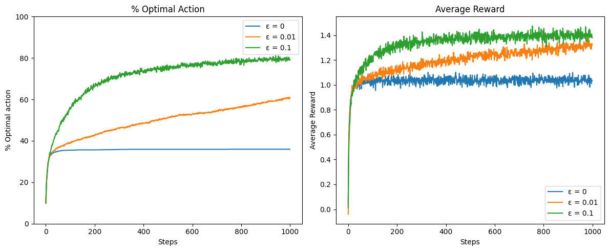

# 🎰 Multi-Armed Bandit Simulation

This project implements a multi-armed bandit solution inspired by **Chapter 2.2: Action-Value Methods** (Figure 2.1) from Sutton & Barto's *Reinforcement Learning: An Introduction (2nd Edition, page 35)*. It explores the effects of different ε-greedy strategies on agent performance in a stochastic reward setting.

---

## 🎯 Objective

To implement a stochastic n-armed bandit environment and evaluate ε-greedy action selection strategies (ε = 0, 0.01, 0.1). The experiment analyzes:

- Average reward over time
- Percentage of optimal action selection

This setup is **based on** the foundational example presented in Sutton & Barto's Figure 2.1.

---

## 🧠 Approach

- **Algorithm**: ε-greedy action selection  
- **Problem Type**: Stochastic n-armed bandit  
- **Exploration Parameters**: Tested with ε = 0, 0.01, and 0.1  
- **Metrics**:
  - Percentage of optimal actions taken
  - Average reward per step  
- **Plays**: 2000 plays over 1000 steps  
- **Implementation**: NumPy-based simulation

---

## 📊 Results



- Left: % Optimal Action chosen over time  
- Right: Average reward earned over time  
- ε = 0.1 performs best due to effective exploration

---

## 🗂️ Project Structure

```
multi-armed-bandit/
├── multi_armed_bandit.ipynb # Main notebook with bandit simulation and plots
├── bandit_results.png # Combined plot of reward and optimal action
├── README.md # Project overview
```
---

## 📚 References

- Sutton, R. S., & Barto, A. G. (2018). *Reinforcement Learning: An Introduction* (2nd ed.).  
  Chapter 2.2 – Action-Value Methods, Figure 2.1, Page 35  
  [Read Online (Free PDF)](https://web.stanford.edu/class/psych209/Readings/SuttonBartoIPRLBook2ndEd.pdf)

- NumPy Documentation. (n.d.). [https://numpy.org/doc/](https://numpy.org/doc/)
